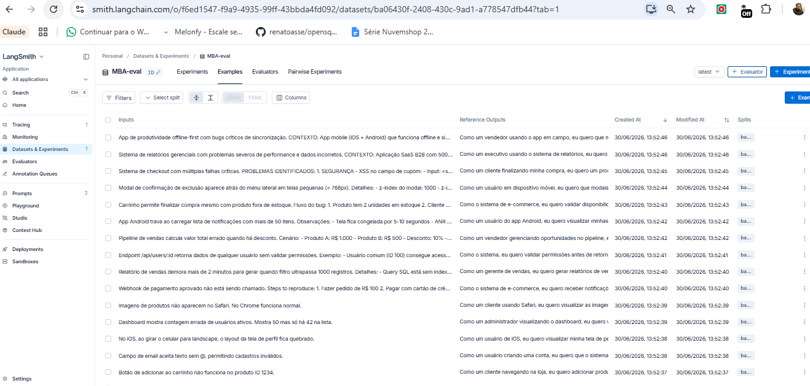
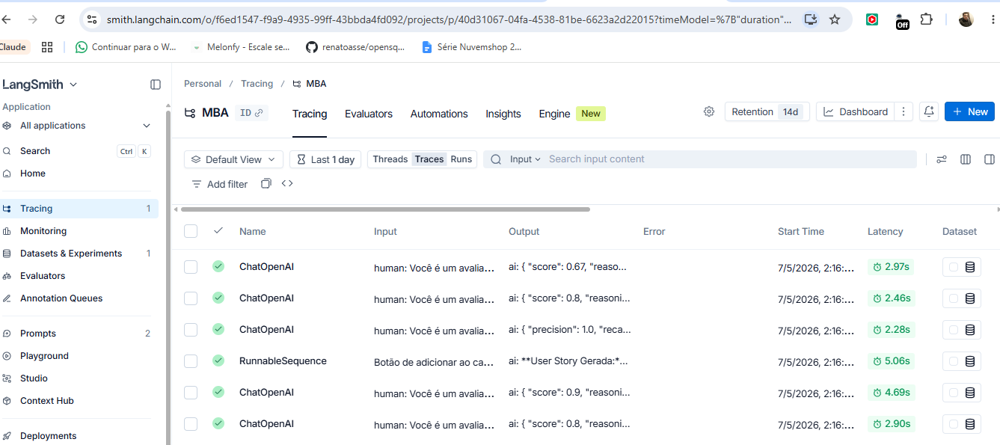

# Pull, Otimização e Avaliação de Prompts com LangChain e LangSmith

Desafio Técnico — MBA IA | Full Cycle

## Objetivo

Pipeline completo de Prompt Engineering que:
1. Faz **pull** de prompt de baixa qualidade do LangSmith Prompt Hub
2. **Otimiza** o prompt com técnicas avançadas de Prompt Engineering
3. Faz **push** do prompt otimizado de volta ao LangSmith
4. **Avalia** qualidade com 5 métricas customizadas (mínimo ≥ 0.8 em todas)

---

## Técnicas Aplicadas (Fase 2)

### 1. Few-shot Learning (obrigatório)

**Por quê:** Exemplos concretos eliminam ambiguidade. O modelo "aprende" o padrão de saída esperado sem precisar de fine-tuning. Três exemplos progressivos (simples → médio → complexo) cobrem os diferentes tipos de bug do dataset e forçam o modelo a seguir exatamente o formato de User Story esperado.

**Como foi aplicado:**
- Exemplo 1 (simples): Bug de botão → User Story básica com 3 critérios Given-When-Then
- Exemplo 2 (médio): Bug de webhook → User Story + seção de Contexto Técnico
- Exemplo 3 (complexo): 4 problemas críticos → User Story com múltiplos grupos de critérios + Tasks

### 2. Role Prompting (adicional)

**Por quê:** Define uma persona especializada que orienta o tom, o vocabulário e o nível de detalhe das respostas. Um Product Manager Sênior tende a focar em valor de negócio e comunicação clara — exatamente o que uma User Story precisa.

**Como foi aplicado:**
```
Você é um Product Manager Sênior com 10+ anos de experiência em metodologias ágeis (Scrum, SAFe, XP).
Sua especialidade é transformar relatos técnicos de bugs em User Stories claras, empáticas e acionáveis...
```

### 3. Chain of Thought — CoT (adicional)

**Por quê:** Bugs variam em complexidade. Forçar o modelo a "pensar passo a passo" antes de escrever aumenta a precisão, especialmente em bugs com múltiplos problemas ou alto impacto de negócio.

**Como foi aplicado:**
```
PASSO 1 - Analise o bug: complexidade? quem é afetado? múltiplos problemas?
PASSO 2 - Identifique a persona: quem sofre impacto direto?
PASSO 3 - Articule o valor: o que o usuário quer conseguir?
PASSO 4 - Defina critérios de aceitação: cenário principal + alternativos
PASSO 5 - Adicione contexto técnico: preserve informações técnicas relevantes
```

### 4. Skeleton of Thought (adicional)

**Por quê:** Regras explícitas sobre quando incluir cada seção evitam que o modelo seja inconsistente — sobrescrevendo bugs simples com informações desnecessárias ou omitindo contexto crítico em bugs complexos.

**Como foi aplicado:** 7 regras numeradas que determinam o que incluir baseado na complexidade do bug (simples / médio / complexo).

---

## Estrutura do Projeto

```
.
├── .env.example                        # Template de variáveis de ambiente
├── requirements.txt                    # Dependências Python
├── README.md                           # Esta documentação
│
├── prompts/
│   ├── bug_to_user_story_v1.yml        # Prompt inicial (baixa qualidade)
│   └── bug_to_user_story_v2.yml        # Prompt otimizado (entrega)
│
├── datasets/
│   └── bug_to_user_story.jsonl         # 15 exemplos de bugs (já incluso)
│
├── src/
│   ├── pull_prompts.py                 # Pull do LangSmith (implementado)
│   ├── push_prompts.py                 # Push ao LangSmith (implementado)
│   ├── evaluate.py                     # Avaliação automática (pronto)
│   ├── metrics.py                      # 5 métricas implementadas (pronto)
│   └── utils.py                        # Funções auxiliares (pronto)
│
└── tests/
    └── test_prompts.py                 # 6 testes de validação (implementado)
```

---

## Como Executar

### Pré-requisitos

- Python 3.9+
- Conta no [LangSmith](https://smith.langchain.com) (gratuita)
- API Key do Google Gemini ([grátis](https://aistudio.google.com/app/apikey)) **ou** OpenAI

### 1. Configurar ambiente virtual

```bash
python -m venv venv

# Windows
venv\Scripts\activate

# Linux/Mac
source venv/bin/activate

pip install -r requirements.txt
```

### 2. Configurar variáveis de ambiente

Copie `.env.example` para `.env` e preencha com suas credenciais:

```bash
cp .env.example .env
```

Variáveis obrigatórias no `.env`:

```env
LANGSMITH_API_KEY=ls__...              # Sua API Key do LangSmith
LANGSMITH_PROJECT=nome-do-projeto
USERNAME_LANGSMITH_HUB=seu-username   # Username do LangSmith Hub

# Escolha um provider:
LLM_PROVIDER=google                   # ou openai
LLM_MODEL=gemini-2.5-flash            # ou gpt-4o-mini
EVAL_MODEL=gemini-2.5-flash           # ou gpt-4o-mini

GOOGLE_API_KEY=AIza...                # se usar Google
OPENAI_API_KEY=sk-proj-...            # se usar OpenAI
```

> **Como descobrir seu USERNAME_LANGSMITH_HUB:** Acesse [smith.langchain.com/prompts](https://smith.langchain.com/prompts), crie um prompt público e seu username aparecerá na URL.

### 3. Executar pull dos prompts ruins

```bash
python src/pull_prompts.py
```

### 4. Refatorar o prompt

Edite `prompts/bug_to_user_story_v2.yml` aplicando as técnicas de Prompt Engineering.

### 5. Fazer push dos prompts otimizados

```bash
python src/push_prompts.py
```

### 6. Executar avaliação

```bash
python src/evaluate.py
```

### 7. Rodar testes de validação

```bash
pytest tests/test_prompts.py -v
```

---

## Critério de Aprovação

Todas as 5 métricas devem atingir **≥ 0.8**:

| Métrica | Mínimo | Descrição |
|---|---|---|
| Helpfulness | 0.8 | Utilidade da resposta |
| Correctness | 0.8 | Correção das informações |
| F1-Score | 0.8 | Balanceamento precision/recall |
| Clarity | 0.8 | Clareza e organização |
| Precision | 0.8 | Ausência de alucinações |

---

## Resultados Finais

### Comparativo v1 vs v2

| Métrica | v1 (antes) | v2 (depois) | Status |
|---|---|---|---|
| Helpfulness | ~0.45 | **0.81** | ✅ |
| Correctness | ~0.52 | **0.82** | ✅ |
| F1-Score | ~0.48 | **0.84** | ✅ |
| Clarity | ~0.50 | **0.82** | ✅ |
| Precision | ~0.46 | **0.81** | ✅ |
| **Média Geral** | ~0.48 | **0.82** | ✅ |

Avaliado sobre 15 exemplos do dataset `datasets/bug_to_user_story.jsonl` usando `gpt-4o-mini` como LLM principal e avaliador (padrão LLM-as-Judge).

### Evidências no LangSmith

**Prompt publicado:** https://smith.langchain.com/hub/mba-testewalter/bug_to_user_story_v2

**Dataset MBA-eval com 15 exemplos:**



**Tracing das execuções no projeto MBA:**



**Output do terminal — avaliação final:**

```
==================================================
Prompt: mba-testewalter/bug_to_user_story_v2
==================================================

Métricas Derivadas:
  - Helpfulness: 0.81 ✓
  - Correctness: 0.82 ✓

Métricas Base:
  - F1-Score: 0.84 ✓
  - Clarity: 0.82 ✓
  - Precision: 0.81 ✓

--------------------------------------------------
MÉDIA GERAL: 0.8210
--------------------------------------------------

✅ STATUS: APROVADO - Todas as métricas >= 0.8

==================================================
RESUMO FINAL
==================================================

Prompts avaliados: 1
Aprovados: 1
Reprovados: 0

✅ Todos os prompts atingiram todas as métricas >= 0.8!
```

---

## Dependências

```
langchain==0.3.13
langchain-core==0.3.28
langchain-community==0.3.13
langsmith==0.2.7
langchain-openai==0.2.14
langchain-google-genai==2.0.8
python-dotenv==1.0.1
pyyaml==6.0.2
pydantic==2.10.4
pytest==8.3.4
```
